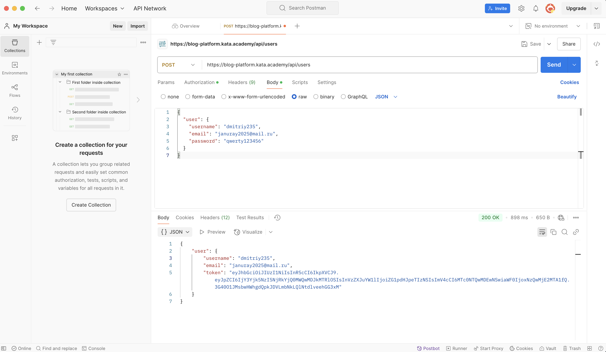
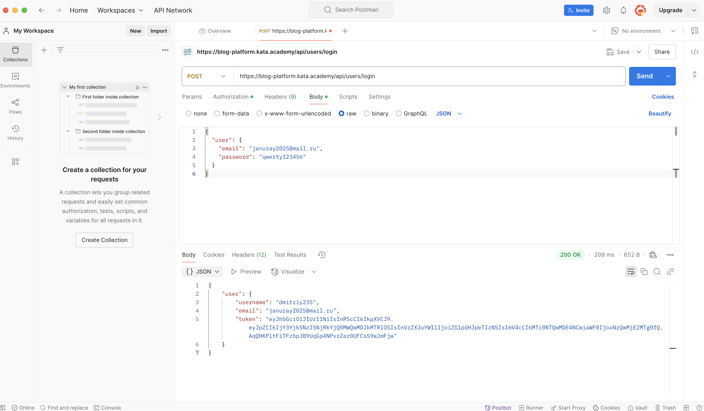
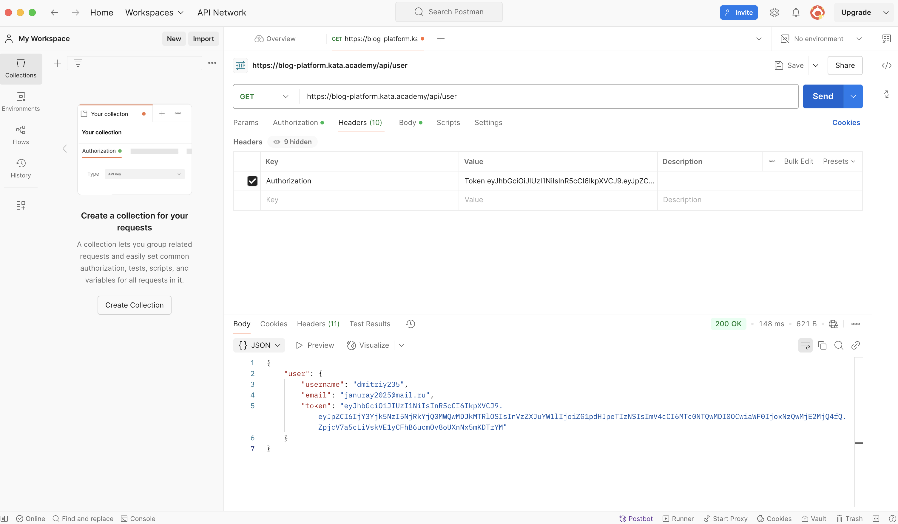

1. Регистрируюсь, отправляя POST запрос на https://blog-platform.kata.academy/api/users, получаю положительный ответ.

2. Авторизуюсь, отправляя POST запрос на https://blog-platform.kata.academy/api/users/login, получаю положительный ответ.

3. Получаю данные текущего пользователя используя заголовок, отправляя GET запрос на https://blog-platform.kata.academy/api/user, получаю положительный ответ.

